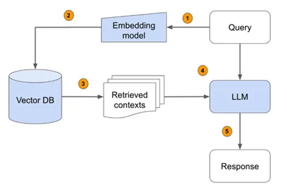

RAG-con-LLMS
============

Descripción del Proyecto
------------------------



Este proyecto implementa una solución de tipo RAG (retrieved augmented generation) que permite interactuar con un modelo de lenguaje (LLM) a través de una API para generar respuestas a preguntas basadas en un documento proporcionado. Utiliza embeddings para dividir el documento en chunks y almacenar estos en una base de datos vectorial para realizar búsquedas de similaridad y proporcionar contexto relevante al LLM.

Características
---------------


-   API: Desarrollada en FastAPI para interactuar con el LLM.
-   LLM: Utiliza un modelo de Cohere para generar respuestas, .
-   Modelo de Embeddings: Divide el documento en chunks y los almacena en una base de datos vectorial utilizando ChromaDB. Modelo utilizado : "embed-multilingual-v3.0"
-   Caché: Implementa una caché simple para almacenar y recuperar respuestas generadas previamente.

Estructura del Proyecto
-----------------------

```plaintext
.
├── app
│   ├── api
│   │   └── endpoints.py        # Contiene los endpoints de la API.
│   ├── cache
│   │   └── cache.py            # Implementa la clase SimpleCache para manejo de caché.
│   ├── core
│   │   └── config.py           # Archivo de configuración centralizado.
│   │   └── model.py            # Inicialización del modelo y embeddings.
│   ├── database
│   │   └── setup.py            # Script para configurar y generar la base de datos.
│   │   └── chroma              # Contiene la base de datos Chroma generada.
│   ├── models
│   │   └── request_models.py   # Modelos de solicitud usando Pydantic.
│   ├── utils
│   │   └── language_detection.py  # Funciones utilitarias para detección de idioma.
│   │   └── text_processing.py     # Funciones de procesamiento de texto.
│   └── main.py                 # Punto de entrada principal de la aplicación FastAPI.
├── data
│   └── documento.docx          # Documentos de datos.
├── postman
│   └── RAG API Collection pi data.postman_collection.json  # Colección de Postman para pruebas de la API.
├── Dockerfile                  # Archivo para construir la imagen Docker.
└── requirements.txt            # Archivo de dependencias.`
```

Instalación y Configuración
---------------------------

### Prerrequisitos

-   Python 3.10
-   [Docker](https://www.docker.com/)
-   [Postman](https://www.postman.com/downloads/)

### Instalación

1.  Clona el repositorio:

    ```sh
    git clone https://github.com/tu_usuario/RAG-con-LLMS.git
    cd RAG-con-LLMS
    ```
2.  Crea un entorno virtual e instala las dependencias:

    ```sh
    python -m venv venv
    source venv/bin/activate  # En Windows: venv\Scripts\activate
    pip install -r requirements.txt
    ```


3.  Configura las variables de entorno:

    -   Abre `app/core/config.py` y establece tu clave API de Cohere:

        ```python
        COHERE_API_KEY = "tu_clave_api"
        ```
### Configuración de la Base de Datos

1.  Ejecuta el script para configurar la base de datos:

   ``` sh
    python app/database/setup.py
   ```

### Ejecución de la API

1.  Inicia la API:

    ```sh
    uvicorn app.main:app --host 0.0.0.0 --port 8000
    ```

### Uso de Docker

1.  Construye la imagen Docker:

    ```sh
    docker build -t rag-con-llms .
    ```

2.  Inicia un contenedor desde la imagen:

    ```sh
    docker run -p 8000:8000 rag-con-llms
    ```

Uso de la API
-------------

### Endpoints Disponibles

-   POST /ask: Envía una pregunta al LLM y obtiene una respuesta basada en el documento proporcionado.

#### Ejemplo de Solicitud

```json
{
  "user_name": "John Doe",
  "question": "¿Quién es Zara?"
}
```

#### Ejemplo de Respuesta

```json
{
  "response": "Zara es un personaje mencionado en el documento. 🌟"
}
```

Pruebas de la API con Postman
-----------------------------

### Configuración de Postman

1.  Descarga e instala [Postman](https://www.postman.com/downloads/).
2.  Inicia el Postman Desktop Agent y asegúrate de que esté corriendo.
3.  Importa la colección de Postman:
    -   Abre Postman y haz clic en "Import" en la parte superior izquierda.
    -   Selecciona el archivo `RAG API Collection pi data.postman_collection.json` desde la carpeta `postman`.
4.  Configura la colección:
    -   Asegúrate de que la API esté corriendo localmente en `http://localhost:8000`.
5.  Ejecuta las solicitudes:
    -   Selecciona la solicitud "Ask Question" en la colección y haz clic en "Send" para enviar la solicitud y ver la respuesta.
    -   También puedes ejecutar toda la colección utilizando el Collection Runner de Postman para ejecutar múltiples solicitudes en secuencia.

Consideraciones
---------------

-   Asegúrate de que la API key de Cohere esté correctamente configurada en `app/core/config.py`.
-   Verifica que la base de datos se haya creado correctamente en `app/database/chroma` antes de iniciar la API.
-   Utiliza Postman para probar los endpoints y asegurarte de que las respuestas sean correctas y consistentes.
